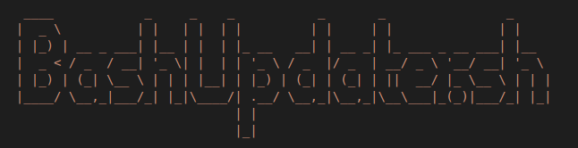

# BashUpdater

BashUpdater is a compilation of updating bash scripts

|  Linux  | OtherOses   | 
| ------- | ----------- | --- |
|  Alpine |   Freebsd   |
|   Arch  |   HaikuOs   |
|   Crux  | OpenIndiana |
|  Debian |
|  Fedora |
|  Gentoo |
| OpenSuse|
|  Solus  |
|  Turbo  |
|  Ubuntu |
